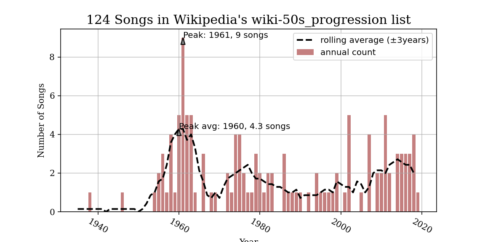
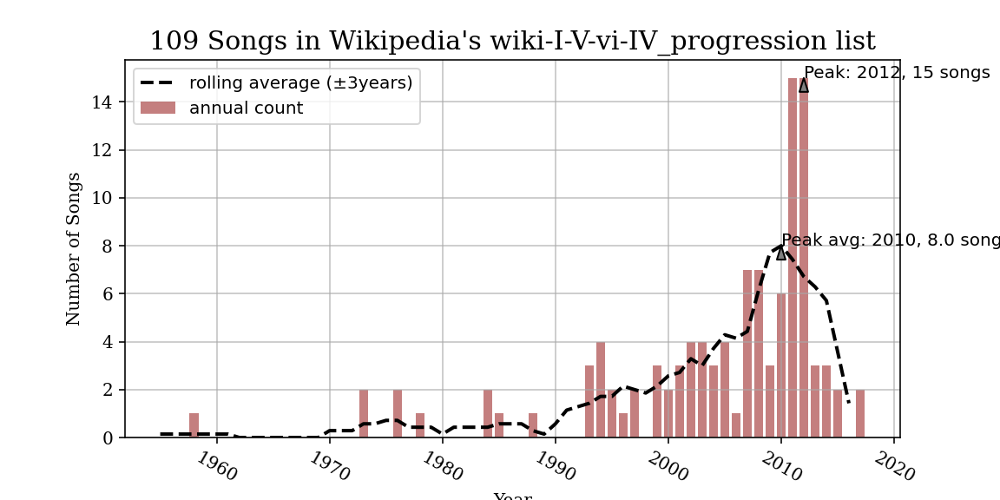
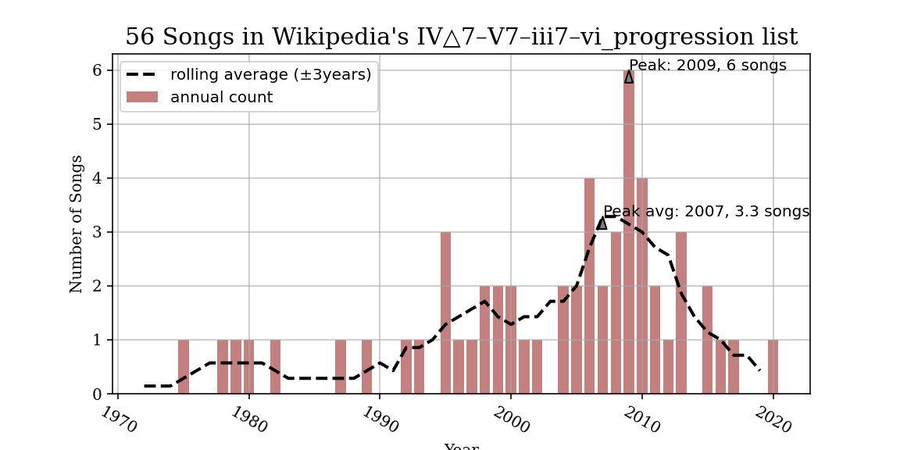

# Wikipedia Chord Progressions

Examples from wikipedia entries for some chord progressions

## Overview

I taught on the [doo-wop progression](https://viva.pressbooks.pub/openmusictheory/chapter/4-chord-schemas/#chapter-1623-section-1) and thaught it'd be interesting to plot the examples given on wikipedia to gauge its usage. The dataset is pretty small, but is still useful. Here's an example plot:

## Running yourself
- Clone the repo and install the required packages given in `requirements.txt`, essentially BeautifulSoup, pandas, Jupyter notebook, and matplotlib, along with their requirements.
- `main.ipynb` leads through basic usage of the functions, including outputting plots.

There are pre-scraped .csv files and plots for three progressions already: "doo-wop", ["singer-songwriter"](https://viva.pressbooks.pub/openmusictheory/chapter/4-chord-schemas/#chapter-1623-section-2), and ["ōdō"](https://en.wikipedia.org/wiki/IV%E2%96%B37%E2%80%93V7%E2%80%93iii7%E2%80%93vi_progression).

This was essentially also a mini-project to help me learn virtual environments, .gitignore, git, and some offline practice with various packages' help files.

